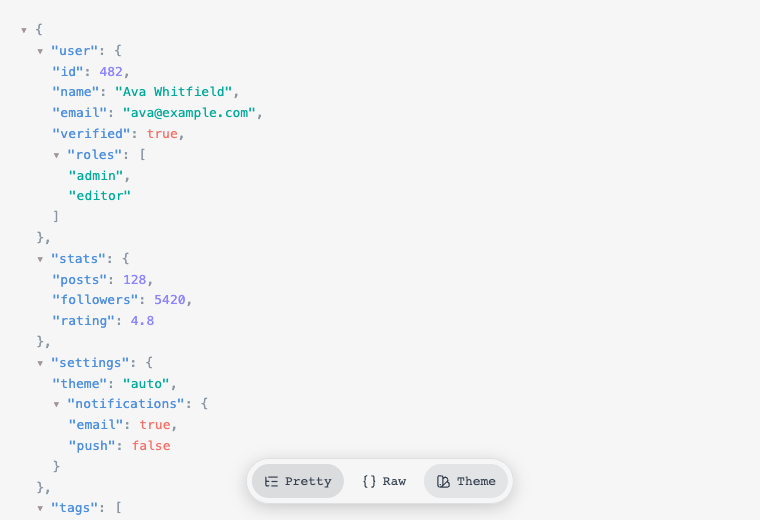
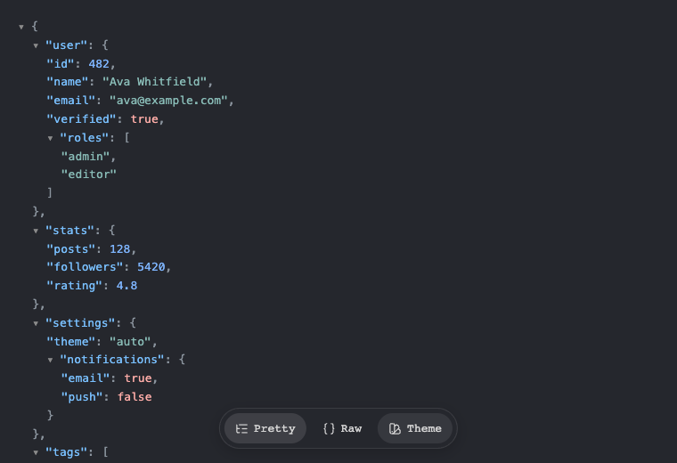
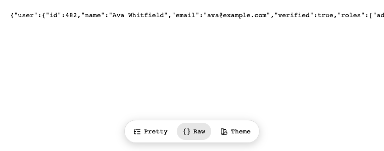
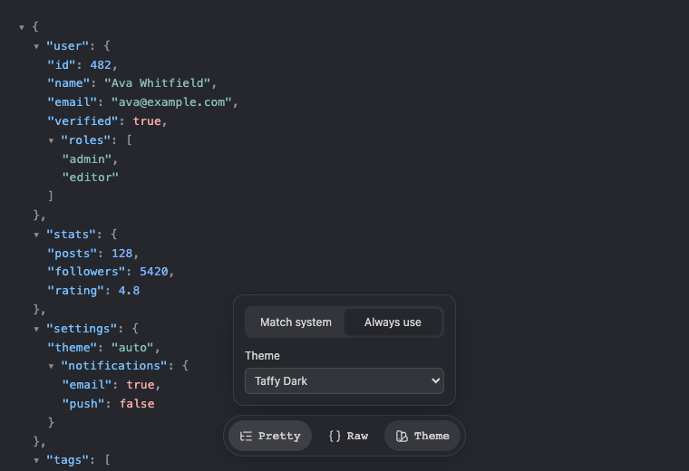

  

<h1 align="center">Refined JSON</h1>

  Turns any raw JSON page into a readable, collapsible tree with syntax
  highlighting — switch back to the exact raw text any time, and pick a
  theme that follows your system or stays fixed.

  
  

## Features

- **Automatic** — navigate to any URL or local file that returns JSON and
  it takes over immediately, no click required.
- **Collapsible tree** — click any `{` or `[` to collapse or expand that
  object or array.
- **Raw view** — see the exact, unformatted response any time, exactly as
  the server sent it, one click away.
- **Light/dark themes** — pick a light theme and a dark theme that switch
  automatically with your system, or lock in one theme that's always used.
- Works on Chrome/Chromium-based browsers, plus Firefox.

## Installing

Refined JSON isn't on the Chrome Web Store or Firefox Add-ons yet. For now,
build it from source and load it as an unpacked/temporary extension — see
[DEVELOPMENT.md](DEVELOPMENT.md#loading-the-extension) for the exact steps
for your browser.

## Using it

### View any JSON page

Navigate to a URL that returns JSON — an API endpoint, a raw file on
GitHub, a local `.json` file — and Refined JSON replaces the browser's
default raw text with a syntax-highlighted, collapsible tree.

### Collapse and expand

Click any `{` or `[` row to collapse that object or array down to a
summary (`{ 3 keys }`, `[ 12 items ]`), and click it again to expand it
back.

### Raw view

Bottom-center floating buttons switch between the pretty tree and the
exact raw text the server sent — no formatting, no highlighting, and no
theme; it ignores your theme choice entirely and looks exactly like a
plain browser tab, following your OS's light/dark setting the same way
the browser's own raw view would if the extension weren't there.

  

### Themes

The **Theme** button opens a picker: choose **Match system** (pick a
separate light theme and dark theme, switched automatically with your OS),
or **Always use** one fixed theme regardless of system preference.

  

## Known limitations

- Local `.json` files need **Allow access to file URLs** turned on for
  this extension in your browser's settings — a per-browser toggle the
  extension can't enable on its own.
- Detection relies on the page's `Content-Type`, plus a `.json`-extension
  fallback for the ambiguous types raw-file hosts commonly use
  (`text/plain`, `application/octet-stream`, e.g. GitHub raw links). A
  server serving JSON under some other MIME type, with a URL that doesn't
  end in `.json`, won't be picked up.

## Contributing / technical docs

See [DEVELOPMENT.md](DEVELOPMENT.md) for the project structure, local dev
setup, and build/release steps.

## Credits

Theme colors (Taffy, Vercel, VS Code, One Dark Pro, and the rest of the
picker) come from [Sugar High](https://sugar-high.vercel.app/)'s bundled
themes.

## Support

If Refined JSON's useful to you, you can [buy me a coffee](https://ko-fi.com/eddiesigner).

## License

[MIT](LICENSE)
